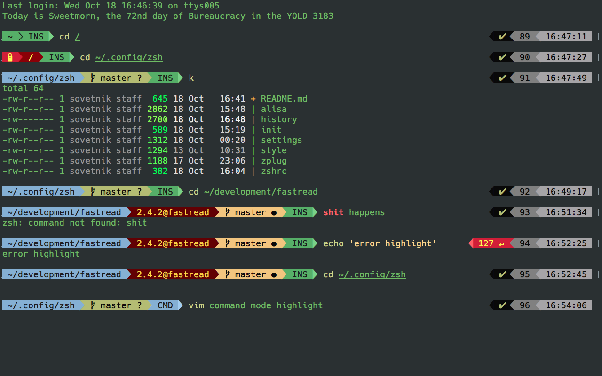

# ZSH configuration for vimmer and rubyist



## Installation

Clone this repo somewhere in your home

``` sh
cd ~/.config
git clone git@github.com:sovetnik/zsh.git
cd zsh
./install.sh
```

Install via script
``` sh
./install.sh
```

Maybe you want to see you own zshrc in this folder, so add a link
Make sure that you don't have `.zshrc` in home directory before creating a link

``` sh
cd ~/.config/zsh
ln zshrc ~/.zshrc
```

Install Zplug and native ext

``` sh
brew install zplug zsh-autosuggestions zsh-history-substring-search ddate
```

Add your own settings in ignored file `personal`
Something like exporting environment tokens, aliases

Now, open new terminal session and Zplug ask you to install plugins.

## Enjoy :)
